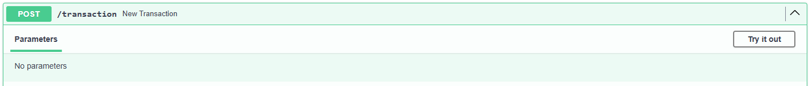
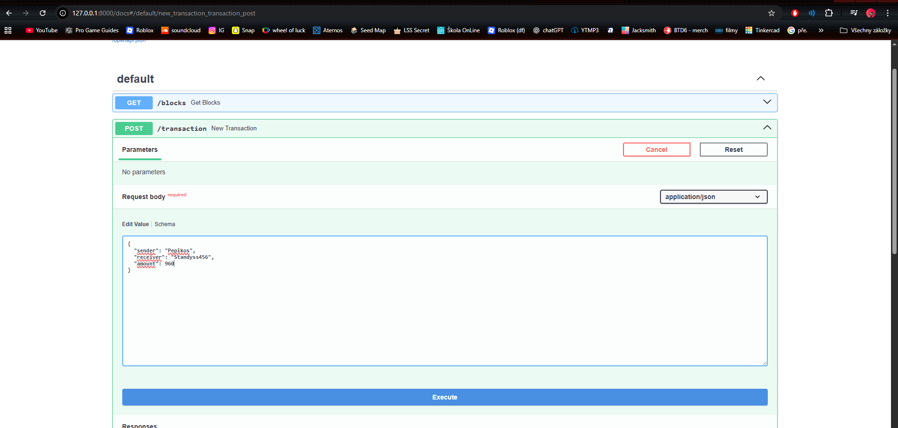
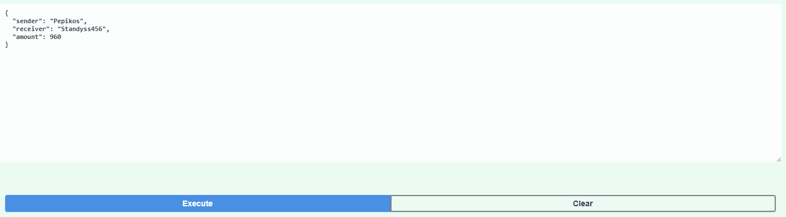
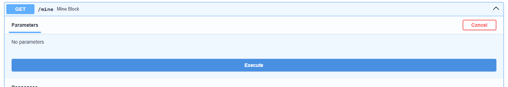
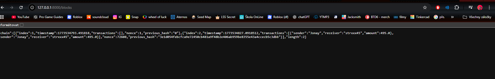
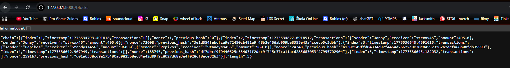

# Cigicoin (Educational Blockchain with Persistence)

Experimentální, minimalistické blockchainové API navržené pro výuku principů distribuovaných databází. Jedná se o vylepšenou verzi projektu Fisicoin, která řeší trvalé uchovávání dat.

Projekt ukazuje základní principy blockchainu v praxi:
* **Integrita dat:** Kryptografické propojování bloků pomocí hashovacího algoritmu SHA-256.
* **Proof of Work:** Simulace "těžby" pomocí hledání správného nonce.
* **Ukládání do souboru:** Data se neztrácí po vypnutí serveru, ale ukládají se do `blockchain.json`.
* **Mempool:** Fronta čekajících transakcí před zápisem do bloku.
* **Validace:** Automatická kontrola neporušenosti celého řetězce.

## Instalace a spuštění

Ke spuštění projektu je potřeba mít nainstalovaný Python.

1. Otevřete terminál ve složce projektu.
2. Nainstalujte potřebné závislosti (FastAPI a Uvicorn pro běh serveru):
```
   pip install -r requirements.txt
```
3. Spusťte API server:
```
   python -m uvicorn main:app --reload
```

## Řešení problémů (Změna portu)

Pokud se po spuštění serveru stránka nenačítá nebo terminál hlásí chybu (např. "address already in use"), pravděpodobně port 8000 už používá jiná aplikace.

V takovém případě můžete server spustit na jiném portu (např. 8001) pomocí tohoto příkazu:
python -m uvicorn main:app --reload --port 8001

## Trvalé uchování dat (Persistence)

Hlavním rozdílem oproti základní verzi je automatické ukládání dat. Zatímco běžné školní ukázky drží data jen v operační paměti (RAM), Cigicoin je ukládá přímo na disk.

**Jak to funguje:**
1. **Ukládání:** Při každém úspěšném vytěžení nového bloku se celý řetězec převede do formátu JSON a zapíše se do souboru `blockchain.json` ve složce projektu.
2. **Načítání:** Při každém startu serveru se program nejdříve podívá, zda tento soubor existuje. Pokud ano, načte veškerou historii bloků z něj.

Díky tomu můžete server kdykoliv vypnout, a při dalším spuštění bude vaše historie transakcí i vytěžených bloků stále k dispozici.

## Jak používat API

Aplikace automaticky generuje interaktivní grafické rozhraní. Po spuštění serveru stačí v prohlížeči otevřít http://127.0.0.1:8000 (nebo váš zvolený port). Budete přesměrováni na /docs:

* GET /blocks - Vrátí historii bloků (načtenou ze souboru).
* POST /transaction - Přidá novou transakci do čekárny.
* GET /mine - Spustí těžbu a automaticky uloží změnu do JSONu.
* GET /validate - Ověří, zda nebyla data v souboru ručně upravena nebo narušena.

## Ukázky

### Transaction
Pro odeslání coinu stiskneme vpravo tlačítko "Try it out".

V JSON poli upravíme data a dáme "Execute". Tím se transakce pošle do čekárny.



### Mine (Těžba)
Zde opět přes "Try it out" a "Execute" spustíme těžbu. V tuto chvíli se data propíší do souboru `blockchain.json`.


### Blocks (Výpis historie)
Na adrese http://127.0.0.1:8000/blocks vidíme uložená data. Tato data zůstanou v prohlížeči i po restartu serveru.


